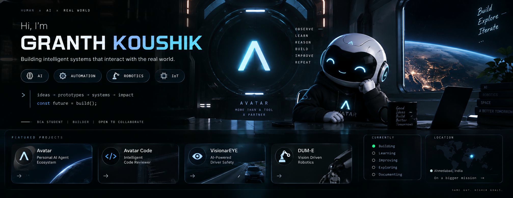

  

&nbsp;

&nbsp;

 

BUILD • EXPLORE • LEARN • ITERATE

I build AI systems, intelligent software, and robots that interact with the real world.

 

🧠 AVATAR

More than a tool. A partner.

Avatar is the AI ecosystem I'm building around intelligent agents.

The vision is simple:

SEE
 ↓
UNDERSTAND
 ↓
REASON
 ↓
ACT
 ↓
REMEMBER
 ↓
LEARN

Avatar is being designed to understand context, use tools, interact with computers, maintain useful memory, automate workflows, and eventually connect AI with physical devices.

The idea

             ┌──────────────────────┐
             │       AVATAR         │
             │    AI AGENT CORE     │
             └──────────┬───────────┘
                        │
       ┌────────────────┼────────────────┐
       ↓                ↓                ↓
   COMPUTER          MEMORY           DEVICES
       │                │                │
       ↓                ↓                ↓
   Apps / Files     Context         Hardware
   Browser / IDE    History         Robotics
   Tools            Projects        IoT

Future goal: make AI feel less like a chatbot and more like an intelligent collaborator.

 

Want to talk to Avatar?

The public Avatar interface is part of the ecosystem I'm building.

[ AVATAR ONLINE → ] (link will be connected when the public Avatar app is deployed)

🚀 FEATURED PROJECTS

<table>
<tr>
<td width="50%" valign="top">

🤖 Avatar

Personal AI Agent Ecosystem

AI designed to observe, reason, remember, use tools and operate across a computer environment.

AI Agents Automation Memory Computer Interaction

 

 VIEW PROJECT → 

</td>

<td width="50%" valign="top">

🧠 Avatar Code

24/7 Intelligent Code Reviewer

An AI-powered reviewer designed to understand entire projects, detect issues, analyze code quality and provide actionable fixes.

Code Intelligence AI Review OCR Project Analysis

 

 VIEW PROJECT → 

</td>
</tr>

<tr>
<td width="50%" valign="top">

👁️ VisionarEYE

AI-Powered Driver Safety

A camera-based driver-safety system combining drowsiness detection, crash detection, GPS tracking and emergency notification.

Computer Vision Edge AI GPS Embedded

 

 VIEW PROJECT → 

</td>

<td width="50%" valign="top">

🦾 DUM-E

Vision-Driven Robotics

A robotics system exploring gesture control, computer vision, inverse kinematics and human–robot interaction.

Robotics Computer Vision IK Simulation

 

 VIEW PROJECT → 

</td>
</tr>
</table>

⚙️ HOW I BUILD

             IDEA
              │
              ▼
          RESEARCH
              │
              ▼
          PROTOTYPE
              │
              ▼
             TEST
              │
              ▼
           ITERATE
              │
              ▼
        BUILD BETTER

I learn by building.

I don't want to simply collect technologies. I want to understand how they work by turning them into real systems.

🛠️ TECHNOLOGY

Artificial Intelligence

  

Software

  

Hardware

 

AI                 ████████████████████
AUTOMATION         ██████████████████░░
COMPUTER VISION    █████████████████░░░
ROBOTICS           ███████████████░░░░░
REAL-WORLD AI      ████████████░░░░░░░░

🔭 CURRENTLY EXPLORING

AI AGENTS
LOCAL AI
COMPUTER VISION
ROBOTICS
EDGE AI
HUMAN–COMPUTER INTERACTION
HUMAN–ROBOT INTERACTION
AI + HARDWARE

I'm especially interested in systems where software doesn't just generate an answer — it perceives something, makes a decision, and takes action.

📊 GITHUB

  

🌌 THE BIGGER PICTURE

I'm interested in what happens when:

AI
 +
SOFTWARE
 +
HARDWARE
 +
ROBOTICS
 =
REAL-WORLD INTELLIGENCE

That's the direction I'm exploring.

Not just smarter software.

Systems that can understand the world and do something about it.

LET'S BUILD SOMETHING THAT SHOULDN'T EXIST YET.

 

  

  

SAME GUY. HIGHER GOALS.

